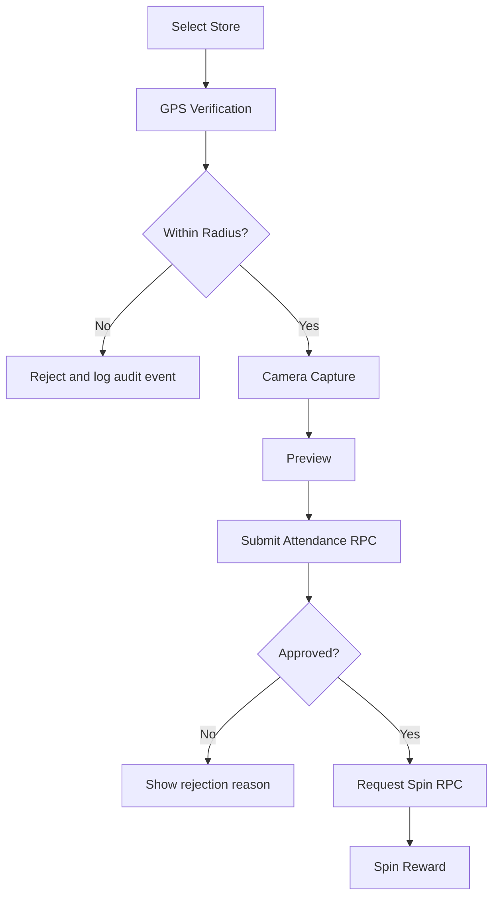

# Sales Attendance & Spin Wheel App

This app is a mobile sales workflow system built with Expo Router and Supabase.
It handles three things:

1. Sales sign up and sign in.
2. Attendance verification with GPS and camera evidence.
3. A backend-controlled spin wheel reward flow.

The main design principle is that the frontend only coordinates the flow.
The backend is the source of truth for approval, reward eligibility, duplicate prevention, and audit logging.

## Tech Stack

- Expo SDK 54
- React Native 0.81
- TypeScript
- Expo Router
- Supabase Auth, PostgreSQL, Storage, and RLS

## Quick Start

```bash
cd sales-spin-app-v2
npm install
npm start
```

The current branch already points at a Supabase project in `src/lib/config.ts` and `src/lib/supabase.ts`.
If you want to swap environments, update those files or wire them to environment variables first.

## What the App Does

The app is structured around the sales visit lifecycle:

1. A user creates an account or signs in.
2. The app loads the user profile from `public.sales`.
3. The user selects a store.
4. The app verifies the user is physically near that store.
5. The user captures a fresh photo using the camera.
6. The app sends the evidence to Supabase for server-side attendance validation.
7. If attendance is approved, the user requests a spin.
8. The backend selects the reward and enforces the one-spin-per-store-per-day rule.

## App Flow

```mermaid
flowchart TD
  A[App Launch] --> B[Root Layout]
  B --> C[AuthProvider]
  B --> D[AttendanceFlowProvider]
  C --> E[Get Session]
  E --> F{Session exists?}
  F -- No --> G[/auth/login]
  F -- Yes --> H[Load Sales Profile]
  H --> I{Role admin?}
  I -- Yes --> J[/admin]
  I -- No --> K[/(sales)]
```



## Route Structure

The `app/` directory is the navigation tree. Each file is a screen or layout.

```text
app/
  _layout.tsx              Root provider and stack setup
  index.tsx                Redirect gate based on auth + role
  auth/login.tsx           Sign in screen
  auth/signup.tsx          Sign up screen
  (sales)/_layout.tsx      Sales flow stack
  (sales)/index.tsx        Sales home
  (sales)/stores.tsx       Store search and selection
  (sales)/attendance/*     GPS, camera, preview, result
  (sales)/spin/*           Spin wheel and reward result
  (sales)/history.tsx      Attendance and spin history scaffold
  admin/_layout.tsx        Admin stack
  admin/*.tsx              Admin dashboard and scaffolds
```

## Startup and Auth Flow

### Root Layout

[`app/_layout.tsx`](app/_layout.tsx) is the top-level bootstrap.
It loads fonts, prevents the splash screen from hiding too early, and wraps the app in two providers:

- `AuthProvider` for session, profile, sign-in, sign-up, and sign-out.
- `AttendanceFlowProvider` for cross-screen attendance state such as selected store and captured photo.

### Redirect Gate

[`app/index.tsx`](app/index.tsx) is a route gate.
It waits for auth state to finish loading, then:

- redirects to `/auth/login` if there is no session,
- redirects to `/admin` if the loaded profile has `role === 'admin'`,
- otherwise redirects to `/(sales)`.

This file is the first place to check if navigation is wrong after login.

### Auth Context

[`src/features/auth/AuthContext.tsx`](src/features/auth/AuthContext.tsx) is the main auth controller.
It exposes:

- `session`
- `user`
- `profile`
- `isLoading`
- `isAdmin`
- `signIn`
- `signUp`
- `signOut`
- `refreshProfile`

How it works:

1. `supabase.auth.getSession()` loads the persisted session on startup.
2. `supabase.auth.onAuthStateChange()` keeps the in-memory session in sync.
3. When a session exists, `fetchSalesProfile()` loads the matching row from `public.sales`.
4. After profile load, `registerDevice()` records the device in `public.devices`.

Sign-in is special:

- `signIn()` calls a password-token fallback endpoint directly, then passes the returned tokens into `supabase.auth.setSession()`.
- After the session is established it logs a `LOGIN` audit event and registers the device.

Sign-up is also special:

- `signUp()` does not use the normal frontend auth flow.
- It calls the `signup_sales_user` RPC so the backend can create the Supabase Auth user securely.
- The user is sent back to the login screen after account creation.

The public auth hook in [`src/features/auth/useAuth.ts`](src/features/auth/useAuth.ts) is just a thin wrapper around this context.

## Login and Sign Up Screens

[`app/auth/login.tsx`](app/auth/login.tsx) and [`app/auth/signup.tsx`](app/auth/signup.tsx) are intentionally simple form screens.
They only handle validation, user input, and navigation.

### Login Screen

The login screen:

- validates email format with `isValidEmail()`,
- validates password length,
- calls `signIn(email, password)` from auth context,
- then routes to `/(sales)/attendance` after a successful sign-in.

It also includes a dev-only link to the GPS prototype flow.

### Sign Up Screen

The sign up screen:

- validates username length,
- validates email format,
- validates password length,
- confirms passwords match,
- calls `signUp({ username, email, password, name })`,
- then redirects the user back to login after success.

Important detail:

- sign up is account creation only,
- sign in is a separate step,
- and that separation is intentional in the current architecture.

## Sales Flow

The sales experience is under `app/(sales)/`.
It is a wizard-like workflow built from route screens and shared transient state.

### Sales Home

[`app/(sales)/index.tsx`](app/(sales)/index.tsx) is the entry screen for sales users.
It shows three primary actions:

- Select Store
- GPS Prototype
- View History

It also exposes sign out.

### Attendance Flow State

[`src/features/attendance/AttendanceFlowContext.tsx`](src/features/attendance/AttendanceFlowContext.tsx) stores the cross-screen values used by the flow:

- `selectedStore`
- `photoUri`

This context exists because the attendance flow spans multiple screens and route transitions.
It is also the reset point if you want to start over cleanly.

### Store Selection

[`app/(sales)/stores.tsx`](app/(sales)/stores.tsx) searches active stores through `searchStores()`.

The store service in [`src/services/storeService.ts`](src/services/storeService.ts):

- queries `public.stores`,
- filters to `status = 'active'`,
- supports pagination,
- sanitizes the search string,
- and searches by name, store code, or address.

When a user selects a store, the screen stores it in `AttendanceFlowContext` and navigates back into the attendance flow.

### GPS Verification

[`app/(sales)/attendance/index.tsx`](app/(sales)/attendance/index.tsx) is the GPS prototype and the first important gate before camera capture.

The logic lives in [`src/features/gps/useGpsVerification.ts`](src/features/gps/useGpsVerification.ts):

- requests foreground location permission,
- reads the current position with high accuracy,
- computes distance against the selected store,
- determines whether the user is within the configured radius,
- and returns a structured verification result.

The math is in [`src/utils/distance.ts`](src/utils/distance.ts).
It uses the Haversine formula to calculate distance in meters.

This is important because the app does not trust the UI state alone.
The frontend can show the result, but the backend still validates the submission again.

### Camera Capture

[`app/(sales)/attendance/camera.tsx`](app/(sales)/attendance/camera.tsx) uses `expo-camera` to take a fresh photo.
The screen intentionally does not include a gallery picker.

The screen flow is:

1. Require camera permission.
2. Open the back camera.
3. Capture a photo.
4. Save the local URI into `AttendanceFlowContext`.
5. Navigate to the preview screen.

### Preview and Result Screens

[`app/(sales)/attendance/preview.tsx`](app/(sales)/attendance/preview.tsx) shows the captured image and is where final attendance submission will eventually happen.
Right now it is a scaffold that explains the backend RPC is ready.

[`app/(sales)/attendance/result.tsx`](app/(sales)/attendance/result.tsx) is also scaffolded.
It explains that the server decides whether attendance is approved or rejected.

### Attendance Service

[`src/services/attendanceService.ts`](src/services/attendanceService.ts) is the backend bridge for the completed attendance path.

What it does:

- reads the signed-in user from Supabase Auth,
- uploads the captured image to the private `attendance-photos` bucket,
- builds a photo path using sales id, store id, and a UUID,
- calls the `submit_attendance` RPC,
- and returns the structured result.

The important rule is that the app never decides final approval itself.
The database function does.

It also exposes:

- `getMyAttendanceHistory()` for the personal history screen,
- `getAttendancePhotoUrl()` for resolving a storage object into a public URL.

## Spin Flow

The spin flow lives in `app/(sales)/spin/`.

[`app/(sales)/spin/index.tsx`](app/(sales)/spin/index.tsx) is a scaffolded wheel screen.
It explains that the real reward selection is handled by the server.

[`app/(sales)/spin/result.tsx`](app/(sales)/spin/result.tsx) is the reward result screen.
It is currently a placeholder for the backend response.

The backend-facing code is in [`src/services/spinService.ts`](src/services/spinService.ts).
It calls the `request_spin` RPC and returns:

- spin id,
- status,
- reward data when present,
- rejection reason when spin is denied.

Backend enforcement matters here because the app must not randomize rewards client-side.

## History Screens

[`app/(sales)/history.tsx`](app/(sales)/history.tsx) is currently a scaffold.
The data access functions already exist:

- `getMyAttendanceHistory()` in `attendanceService.ts`
- `getMySpinHistory()` in `spinService.ts`

When this screen is wired up, it should read those service functions rather than querying the database directly from UI code.

## Admin Flow

The `app/admin/` tree is a scaffolded admin area.

[`app/admin/_layout.tsx`](app/admin/_layout.tsx) defines the admin stack.
[`app/admin/index.tsx`](app/admin/index.tsx) is the admin dashboard that routes to the other admin screens.

The admin screens are placeholders for now:

- attendance monitoring
- spin monitoring
- store management
- sales management
- reward management

The intended contract is that admins can inspect and manage all the critical entities while normal sales users only see their own data.

## Data Model and Backend Rules

The database schema is defined in `supabase/migrations/`.

### Main Tables

- `sales` stores the app profile linked to `auth.users.id`.
- `stores` stores store coordinates, radius, and status.
- `attendance` stores GPS evidence, photo path, approval state, and rejection reason.
- `rewards` stores reward definitions and probabilities.
- `spins` stores daily spin attempts and the selected reward.
- `devices` stores device identifiers per user.
- `audit_logs` stores event history for login, attendance, GPS rejection, camera capture, and spin actions.

### Important Constraints

- `attendance.status` is managed by backend logic.
- `spins` has a unique constraint on `(sales_id, store_id, spin_date)`.
- `stores.radius_meters` is constrained to a valid range.
- reward probability is stored server-side and used for weighted selection.

### RLS and Security

`supabase/migrations/002_rls_policies.sql` enables row level security on every table.

The important rule is that users can only see or change the rows they are allowed to access.
Admins get elevated access through the `is_admin()` helper.

### Storage

`supabase/migrations/003_storage_and_functions.sql` creates the private `attendance-photos` bucket.
Users can upload their own attendance photos, but the bucket is not public.

### RPC Functions

These are the main backend business functions:

- `submit_attendance`
- `request_spin`
- `signup_sales_user`
- `is_admin`
- `haversine_distance_meters`

#### `submit_attendance`

This function:

1. checks that the user is authenticated,
2. loads the store,
3. computes distance from the store,
4. rejects submissions outside the store radius,
5. rejects submissions with poor GPS accuracy,
6. rejects submissions without a photo path,
7. inserts the attendance row,
8. writes an audit log,
9. returns the result to the app.

#### `request_spin`

This function:

1. checks that the user is authenticated,
2. verifies the attendance belongs to the user and store,
3. requires the attendance to be approved,
4. inserts a spin row using the daily uniqueness constraint,
5. selects a reward using weighted random logic,
6. records the reward and audit log,
7. returns the result to the app.

#### `signup_sales_user`

This function is the secure sign up path.
It:

1. validates username, email, and password,
2. checks for duplicate username and email,
3. hashes the password with bcrypt,
4. creates the `auth.users` row,
5. creates the matching `auth.identities` row,
6. triggers the sales-profile creation logic.

### Signup Trigger

`supabase/migrations/001_initial_schema.sql` and `004_username_signup.sql` keep the `handle_new_user()` trigger aligned with the signup function.
That trigger creates the matching `public.sales` row whenever a new auth user is inserted.

## Important Code Map

| File | Responsibility |
| --- | --- |
| `app/_layout.tsx` | App bootstrap, fonts, providers, and root stack |
| `app/index.tsx` | Redirects users to login, sales, or admin |
| `app/auth/login.tsx` | Login form and validation |
| `app/auth/signup.tsx` | Account creation form and validation |
| `src/features/auth/AuthContext.tsx` | Session, profile, sign-in, sign-up, sign-out |
| `src/features/auth/useAuth.ts` | Safe hook for accessing auth context |
| `src/features/attendance/AttendanceFlowContext.tsx` | Shared store/photo state across attendance screens |
| `src/features/gps/useGpsVerification.ts` | Location permission and radius check |
| `src/services/storeService.ts` | Store search and lookup |
| `src/services/attendanceService.ts` | Attendance upload and RPC submission |
| `src/services/spinService.ts` | Spin RPC calls and spin history |
| `src/services/auditService.ts` | Audit event logging |
| `src/services/deviceService.ts` | Device registration and secure device ID |
| `src/lib/supabase.ts` | Supabase client setup, auth storage, fetch wrapper |
| `src/lib/config.ts` | App-wide Supabase config values |
| `src/types/database.ts` | Typed Supabase database contract |
| `supabase/migrations/*.sql` | Schema, RLS, storage, triggers, and RPC functions |

## Shared UI Components

The app keeps presentation primitives in `src/components/`:

- `ScreenContainer` for screen padding, title, and subtitle.
- `PrimaryButton` for button variants and loading state.
- `FormInput` for consistent text input styling.

These are intentionally small so the route screens stay focused on flow logic instead of layout boilerplate.

## Utilities

`src/utils/validation.ts` contains boundary checks such as:

- email validation,
- GPS accuracy validation,
- search query sanitization.

`src/utils/distance.ts` contains the Haversine distance calculation used by both the client-side GPS prototype and the backend schema.

## Current Status

Implemented and wired:

- auth bootstrap and role-based redirection
- sign up flow backed by a Supabase RPC
- sign in flow backed by the Supabase Auth token endpoint
- store search and selection
- GPS radius verification prototype
- camera-only photo capture
- device registration
- audit logging
- database schema, RLS, storage bucket, and RPC functions

Scaffolded but not yet fully wired:

- attendance submission screen wiring
- spin wheel animation and final result display
- attendance and spin history screens
- admin CRUD and monitoring screens

## Why the Code Is Structured This Way

The app separates three concerns:

1. Route screens manage navigation and form UI.
2. Contexts keep transient workflow state across screens.
3. Services and database functions enforce business rules.

That separation makes the app easier to reason about because the UI does not own the logic that decides approval, reward selection, or access control.

## GPS Prototype (Dev)

From the login screen, use the `GPS Prototype (dev)` link to test store-radius verification without going through the normal full submission path.

This is useful when you want to verify location behavior before the attendance submission flow is fully connected.
