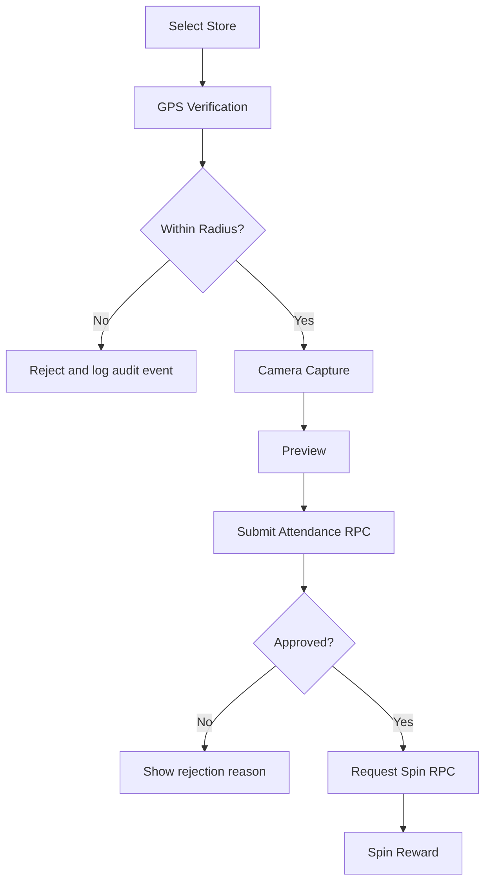

# Sales Attendance & Spin Wheel App

This app is a mobile sales workflow system built with **Expo Router, React Native, TypeScript, and Supabase**.

It handles three main things:

1. Sales sign up and sign in.
2. Attendance verification with GPS and camera evidence.
3. A backend-controlled spin wheel reward flow.

The main design principle is that the frontend only coordinates the flow.

> **The backend is the source of truth** for approval, reward eligibility, duplicate prevention, access control, and audit logging.

---

## Tech Stack

| Technology                     |                 Version |
| ------------------------------ | ----------------------: |
| Node.js                        | See project environment |
| npm                            | See project environment |
| Expo                           |              `~54.0.36` |
| Expo SDK                       |                    `54` |
| React                          |                `19.1.0` |
| React DOM                      |                `19.1.0` |
| React Native                   |                `0.81.5` |
| TypeScript                     |                `~5.9.2` |
| Expo Router                    |               `~6.0.24` |
| Supabase JS                    |              `^2.112.2` |
| React Native Reanimated        |                `~4.1.1` |
| React Native Screens           |               `~4.16.0` |
| React Native Safe Area Context |                `~5.6.1` |
| React Native Web               |               `~0.21.0` |

### Complete Dependency Versions

#### Runtime Dependencies

| Package                                     |    Version |
| ------------------------------------------- | ---------: |
| `@react-native-async-storage/async-storage` |    `2.2.0` |
| `@supabase/supabase-js`                     | `^2.112.2` |
| `expo`                                      | `~54.0.36` |
| `expo-camera`                               | `~17.0.10` |
| `expo-constants`                            | `~18.0.13` |
| `expo-font`                                 | `~14.0.12` |
| `expo-linking`                              |  `~8.0.12` |
| `expo-location`                             |  `~19.0.8` |
| `expo-router`                               |  `~6.0.24` |
| `expo-secure-store`                         |  `~15.0.8` |
| `expo-splash-screen`                        | `~31.0.12` |
| `expo-status-bar`                           |   `~3.0.9` |
| `expo-symbols`                              |   `~1.0.8` |
| `expo-web-browser`                          | `~15.0.11` |
| `react`                                     |   `19.1.0` |
| `react-dom`                                 |   `19.1.0` |
| `react-native`                              |   `0.81.5` |
| `react-native-reanimated`                   |   `~4.1.1` |
| `react-native-safe-area-context`            |   `~5.6.1` |
| `react-native-screens`                      |  `~4.16.0` |
| `react-native-url-polyfill`                 |   `^4.0.0` |
| `react-native-web`                          |  `~0.21.0` |
| `react-native-worklets`                     |    `0.5.1` |

#### Development Dependencies

| Package             |    Version |
| ------------------- | ---------: |
| `@types/react`      |  `~19.1.0` |
| `babel-preset-expo` | `~54.0.12` |
| `typescript`        |   `~5.9.2` |

### Application Version

```text
Application: sales-spin-app-v2
Version: 1.0.0
```

### Expo / React Native Compatibility

The project currently targets:

```text
Expo SDK       54
Expo           ~54.0.36
React          19.1.0
React Native   0.81.5
Expo Router    ~6.0.24
TypeScript     ~5.9.2
```

> **Version source of truth:** `package.json` defines the direct dependency versions for this project. `package-lock.json` contains the complete resolved dependency tree.

---

# Quick Start

```bash
cd sales-spin-app-v2
npm install
npm start
```

The current branch already points at a Supabase project in:

```text
src/lib/config.ts
src/lib/supabase.ts
```

If you want to swap environments, update those files or wire them to environment variables first.

## Available Scripts

### Start Expo

```bash
npm start
```

### Start Android

```bash
npm run android
```

### Start iOS

```bash
npm run ios
```

### Start Web

```bash
npm run web
```

---

# What the App Does

The app is structured around the sales visit lifecycle:

1. A user creates an account or signs in.
2. The app loads the user profile from `public.sales`.
3. The user selects a store.
4. The app verifies the user is physically near that store.
5. The user captures a fresh photo using the camera.
6. The app sends the evidence to Supabase for server-side attendance validation.
7. If attendance is approved, the user requests a spin.
8. The backend selects the reward and enforces the one-spin-per-store-per-day rule.

---

# App Flow

## Authentication Flow

```mermaid
flowchart TD
  A[App Launch] --> B[Root Layout]
  B --> C[AuthProvider]
  B --> D[AttendanceFlowProvider]
  C --> E[Get Session]
  E --> F{Session exists?}
  F -- No --> G[/auth/login]
  F -- Yes --> H[Load Sales Profile]
  H --> I{Role admin?}
  I -- Yes --> J[/admin]
  I -- No --> K[/(sales)]
```

## Attendance and Spin Flow



---

# Route Structure

The `app/` directory is the navigation tree. Each file is a screen or layout.

```text
app/
  _layout.tsx              Root provider and stack setup
  index.tsx                Redirect gate based on auth + role

  auth/
    login.tsx              Sign in screen
    signup.tsx             Sign up screen

  (sales)/
    _layout.tsx            Sales flow stack
    index.tsx              Sales home
    stores.tsx             Store search and selection

    attendance/
      index.tsx            GPS verification
      camera.tsx            Camera capture
      preview.tsx           Attendance preview
      result.tsx            Attendance result

    spin/
      index.tsx             Spin wheel
      result.tsx            Reward result

    history.tsx             Attendance and spin history

  admin/
    _layout.tsx             Admin stack
    *.tsx                   Admin dashboard and scaffolds
```

---

# Startup and Auth Flow

## Root Layout

[`app/_layout.tsx`](app/_layout.tsx) is the top-level bootstrap.

It:

* loads fonts,
* prevents the splash screen from hiding too early,
* initializes the root stack,
* wraps the application in the required providers.

The two main providers are:

* `AuthProvider` for session, profile, sign-in, sign-up, and sign-out.
* `AttendanceFlowProvider` for cross-screen attendance state such as selected store and captured photo.

---

## Redirect Gate

[`app/index.tsx`](app/index.tsx) is the route gate.

It waits for auth state to finish loading, then:

* redirects to `/auth/login` if there is no session,
* redirects to `/admin` if the loaded profile has `role === 'admin'`,
* otherwise redirects to `/(sales)`.

This file is the first place to check if navigation is wrong after login.

---

# Authentication

## Auth Context

[`src/features/auth/AuthContext.tsx`](src/features/auth/AuthContext.tsx) is the main auth controller.

It exposes:

* `session`
* `user`
* `profile`
* `isLoading`
* `isAdmin`
* `signIn`
* `signUp`
* `signOut`
* `refreshProfile`

### Session Initialization

The auth flow works as follows:

1. `supabase.auth.getSession()` loads the persisted session on startup.
2. `supabase.auth.onAuthStateChange()` keeps the in-memory session synchronized.
3. When a session exists, `fetchSalesProfile()` loads the matching row from `public.sales`.
4. After the profile is loaded, `registerDevice()` records the device in `public.devices`.

---

## Sign In

Sign-in uses the current backend token flow.

`signIn()`:

1. Sends the credentials to the password-token endpoint.
2. Receives the authentication tokens.
3. Passes those tokens into `supabase.auth.setSession()`.
4. Logs a `LOGIN` audit event.
5. Registers the device.

---

## Sign Up

Sign-up uses a backend RPC rather than the normal frontend Supabase Auth sign-up flow.

`signUp()` calls:

```text
signup_sales_user
```

This allows the backend to:

* validate account information,
* check duplicate usernames,
* check duplicate email addresses,
* create the authentication user,
* create the corresponding sales profile.

After successful account creation, the user is sent back to the login screen.

Important:

* sign-up is account creation only,
* sign-in is a separate step,
* this separation is intentional in the current architecture.

---

# Login and Sign Up Screens

[`app/auth/login.tsx`](app/auth/login.tsx) and [`app/auth/signup.tsx`](app/auth/signup.tsx) are intentionally simple form screens.

They primarily handle:

* input,
* validation,
* user feedback,
* navigation.

## Login Screen

The login screen:

* validates email format with `isValidEmail()`,
* validates password length,
* calls `signIn(email, password)`,
* routes to the sales attendance flow after successful sign-in.

It also includes a development-only link to the GPS prototype flow.

## Sign Up Screen

The sign-up screen:

* validates username length,
* validates email format,
* validates password length,
* confirms passwords match,
* calls:

```text
signUp({ username, email, password, name })
```

After successful account creation, the user is redirected to login.

---

# Sales Flow

The sales experience is under:

```text
app/(sales)/
```

It is a wizard-like workflow built from route screens and shared transient state.

---

# Sales Home

[`app/(sales)/index.tsx`](app/%28sales%29/index.tsx) is the entry screen for sales users.

It provides:

* Select Store
* GPS Prototype
* View History
* Sign Out

---

# Attendance Flow State

[`src/features/attendance/AttendanceFlowContext.tsx`](src/features/attendance/AttendanceFlowContext.tsx) stores values shared between attendance screens.

Current state includes:

```text
selectedStore
photoUri
```

This context exists because the attendance flow spans multiple screens and route transitions.

It is also the reset point when the user wants to start a new attendance flow.

---

# Store Selection

[`app/(sales)/stores.tsx`](app/%28sales%29/stores.tsx) searches active stores through `searchStores()`.

The store service is:

```text
src/services/storeService.ts
```

It:

* queries `public.stores`,
* filters to `status = 'active'`,
* supports pagination,
* sanitizes the search string,
* searches by store name,
* searches by store code,
* searches by address.

When a user selects a store:

1. The store is stored in `AttendanceFlowContext`.
2. The user is navigated into the attendance flow.

---

# GPS Verification

[`app/(sales)/attendance/index.tsx`](app/%28sales%29/attendance/index.tsx) is the GPS verification screen.

The GPS logic lives in:

```text
src/features/gps/useGpsVerification.ts
```

It:

* requests foreground location permission,
* reads the current position with high accuracy,
* calculates distance from the selected store,
* determines whether the user is within the configured radius,
* returns a structured verification result.

The distance calculation is implemented in:

```text
src/utils/distance.ts
```

It uses the **Haversine formula** to calculate distance in meters.

### Important Security Rule

The frontend GPS check is not authoritative.

The backend performs the GPS validation again when attendance is submitted.

Therefore:

```text
Frontend GPS check
        ↓
User feedback / UX
        ↓
Backend GPS check
        ↓
Authoritative approval or rejection
```

The frontend cannot simply mark an attendance as approved.

---

# Camera Capture

[`app/(sales)/attendance/camera.tsx`](app/%28sales%29/attendance/camera.tsx) uses `expo-camera`.

The application intentionally uses camera capture rather than a gallery picker.

The camera flow is:

1. Request camera permission.
2. Open the back camera.
3. Capture a fresh photo.
4. Send the photo for face detection (see **Face Verification** below).
5. If no face is detected, show the reason and let the user retake — repeat from step 3.
6. Once a face is detected, save the local URI into `AttendanceFlowContext`.
7. Navigate to the preview screen.

---

# Face Verification

Face checking on the captured attendance photo happens in two phases. Only the first is implemented today.

## Phase 1 — Face Detection (Implemented)

Before a captured photo is accepted, [`app/(sales)/attendance/camera.tsx`](app/%28sales%29/attendance/camera.tsx) confirms the photo actually contains a face. This is a detection check only — it does not confirm *whose* face it is.

The detection call is made from:

```text
src/services/faceDetectionService.ts
```

which sends the photo to a small standalone service:

```text
face-service/app.py
```

`face-service` is a separate Python process (FastAPI + DeepFace/RetinaFace) — it is not part of the Expo app and does not get bundled into the mobile build. It exists because DeepFace is a Python/TensorFlow library and cannot run inside React Native.

### What to Do — Steps

1. Install and run the detection service:

   ```bash
   cd face-service
   pip install -r requirements.txt
   uvicorn app:app --reload --host 0.0.0.0 --port 8000
   ```

2. Point the app at it by setting, in `.env`:

   ```text
   EXPO_PUBLIC_FACE_API_URL=http://<your-machine-ip>:8000
   ```

   Use your machine's LAN IP rather than `localhost` when testing on a physical device.

3. On the camera screen, capture a photo as normal.
4. If no face is detected, the app shows the reason and returns control to the shutter button — capture again.
5. Once a face is detected, the flow proceeds to the preview screen as usual.

### Important Security Note

Like GPS verification, this check exists for user experience — fail fast, let the user retake immediately — not as the final authority. It only answers "is there a face in this photo," not "is attendance valid."

## Phase 2 — Face Matching Against the Database (Not Yet Implemented)

Confirming the photo belongs to the *enrolled* sales rep, rather than just containing *a* face, is scaffolded but not wired up.

This requires comparing the captured photo against a reference photo stored for that sales rep, which does not exist in the schema yet. The draft is in:

```text
supabase/migrations/006_face_verification_draft.sql
```

everything in that file is commented out — it is a sketch, not an active migration.

### What to Do — Steps (Future Work)

- Connect admin to spin database
- connect sales and admin (Order) (modify database)
- implement imagge in attendance preview
- remove all approve and reject and pending

1. Review and uncomment `supabase/migrations/006_face_verification_draft.sql`, adding RLS policies consistent with `002_rls_policies.sql`, then apply it. This adds:

   * `sales.reference_photo_path` — where each rep's enrolled reference photo lives in Storage.
   * a private `reference-photos` bucket, mirroring `attendance-photos`.
   * a `face_verification_attempts` table to log match attempts (distance, threshold, model, result).

2. Build an enrollment step (e.g. at sign-up, or an admin-triggered flow) that captures a rep's reference photo once and uploads it to the `reference-photos` bucket, saving the path to `sales.reference_photo_path`.

3. Implement the commented-out `/verify-faces` endpoint in `face-service/app.py`. It is a direct port of `DeepFace.verify(...)` from the original face-matching script this project's detection logic was based on — it fetches the rep's reference photo server-side and compares it against the newly captured photo.

4. Implement the commented-out `verifyFace()` function in `src/services/faceDetectionService.ts` to call that endpoint.

5. Call `verifyFace()` from [`app/(sales)/attendance/preview.tsx`](app/%28sales%29/attendance/preview.tsx), before `submitAttendance()` runs — there is a comment marking the exact spot. Reject or warn before upload, the same "fail fast" shape as Phase 1.

6. Add `FACE_MATCH_SUCCESS` / `FACE_MATCH_FAILED` audit actions (placeholder noted in `src/types/index.ts`) so match attempts show up in the existing audit log alongside `FACE_DETECTED` / `FACE_NOT_DETECTED`.

### Important Security Rule

As with GPS and attendance approval, matching must be authoritative on the backend. The mobile app should never be the one deciding whether a face matches — it only submits the comparison request and displays the server's result.

---

# Attendance Preview and Result

## Preview

[`app/(sales)/attendance/preview.tsx`](app/%28sales%29/attendance/preview.tsx) displays the captured image.

This screen is currently scaffolded for the final attendance submission integration.

The backend attendance RPC is already available.

## Result

[`app/(sales)/attendance/result.tsx`](app/%28sales%29/attendance/result.tsx) is the attendance result screen.

It is intended to display:

* approval,
* rejection,
* rejection reason,
* relevant attendance information.

The final decision must come from the backend.

---

# Attendance Service

The backend bridge is:

```text
src/services/attendanceService.ts
```

It:

1. Reads the signed-in user from Supabase Auth.
2. Uploads the captured image to the private `attendance-photos` bucket.
3. Builds a photo path using:

   * sales ID,
   * store ID,
   * UUID.
4. Calls the:

```text
submit_attendance
```

RPC.
5. Returns the structured backend result.

### Backend Authority

The application never decides final attendance approval itself.

The database function is responsible for the authoritative decision.

The service also exposes:

```text
getMyAttendanceHistory()
getAttendancePhotoUrl()
```

for history and photo retrieval.

---

# Spin Flow

The spin flow lives under:

```text
app/(sales)/spin/
```

## Spin Screen

[`app/(sales)/spin/index.tsx`](app/%28sales%29/spin/index.tsx) is the wheel screen.

The reward is **not randomized inside React Native**.

The server controls:

* spin eligibility,
* duplicate prevention,
* reward selection,
* reward probability,
* final result.

## Result Screen

[`app/(sales)/spin/result.tsx`](app/%28sales%29/spin/result.tsx) displays the reward result.

The current screen is still a placeholder for the final backend response UX.

---

# Spin Service

The backend-facing service is:

```text
src/services/spinService.ts
```

It calls:

```text
request_spin
```

and returns:

* spin ID,
* spin status,
* reward data when present,
* rejection reason when the spin is denied.

### Why Reward Selection Is Server-Side

The application must not perform reward randomization client-side.

The correct architecture is:

```text
Mobile App
    ↓
request_spin RPC
    ↓
Validate eligibility
    ↓
Check daily uniqueness
    ↓
Weighted reward selection
    ↓
Create spin
    ↓
Return reward
```

This prevents the client from manipulating the reward outcome.

---

# History Screens

[`app/(sales)/history.tsx`](app/%28sales%29/history.tsx) is currently scaffolded.

The required data-access functions already exist:

```text
getMyAttendanceHistory()
```

in:

```text
attendanceService.ts
```

and:

```text
getMySpinHistory()
```

in:

```text
spinService.ts
```

When the history screen is completed, it should use these service functions rather than querying the database directly from UI code.

---

# Admin Flow

The admin application lives under:

```text
app/admin/
```

## Admin Layout

[`app/admin/_layout.tsx`](app/admin/_layout.tsx) defines the admin navigation stack.

## Admin Dashboard

[`app/admin/index.tsx`](app/admin/index.tsx) is the admin dashboard.

The current admin screens are scaffolds for:

* attendance monitoring,
* spin monitoring,
* store management,
* sales management,
* reward management.

The intended access model is:

```text
Sales User
    ↓
Own attendance
Own spins
Own profile
Own relevant data

Admin
    ↓
All authorized operational data
Attendance monitoring
Spin monitoring
Store management
Sales management
Reward management
```

---

# Data Model

The database schema is defined in:

```text
supabase/migrations/
```

## Main Tables

### `sales`

Stores the application sales profile linked to:

```text
auth.users.id
```

### `stores`

Stores:

* store name,
* store code,
* address,
* latitude,
* longitude,
* radius,
* status.

### `attendance`

Stores:

* sales user,
* store,
* GPS evidence,
* GPS accuracy,
* photo path,
* approval state,
* rejection reason,
* timestamps.

### `rewards`

Stores:

* reward definitions,
* reward probabilities,
* reward status/configuration.

### `spins`

Stores:

* sales user,
* store,
* spin date,
* selected reward,
* spin status.

### `devices`

Stores device identifiers associated with users.

### `audit_logs`

Stores important application events, including:

* login,
* attendance,
* GPS rejection,
* camera capture,
* spin actions,
* other security/business events.

---

# Important Database Constraints

The backend enforces critical business rules.

## Attendance

`attendance.status` is controlled by backend logic.

The frontend cannot independently approve attendance.

## One Spin Per Store Per Day

The `spins` table has a uniqueness constraint on:

```text
(sales_id, store_id, spin_date)
```

This prevents a user from obtaining multiple spins for the same store on the same day.

## Store Radius

`stores.radius_meters` is constrained to a valid range.

## Reward Probability

Reward probability is stored server-side and is used for weighted reward selection.

---

# Row Level Security

RLS policies are defined in:

```text
supabase/migrations/002_rls_policies.sql
```

Row Level Security is enabled on the application tables.

The fundamental rule is:

> Users can only access rows they are authorized to access.

Administrators receive elevated access through:

```text
is_admin()
```

This keeps access control in the database rather than relying exclusively on frontend navigation.

---

# Storage

Storage configuration is defined in:

```text
supabase/migrations/003_storage_and_functions.sql
```

The application creates a private bucket:

```text
attendance-photos
```

Attendance photos are not stored in a public bucket.

Users can upload their own attendance photos according to the configured storage policies.

The application resolves storage objects through the attendance service when access is required.

---

# Backend RPC Functions

The main backend business functions are:

```text
submit_attendance
request_spin
signup_sales_user
is_admin
haversine_distance_meters
```

---

## `submit_attendance`

This function:

1. Checks that the user is authenticated.
2. Loads the selected store.
3. Computes the distance from the store.
4. Rejects submissions outside the store radius.
5. Rejects submissions with poor GPS accuracy.
6. Rejects submissions without a photo path.
7. Inserts the attendance row.
8. Writes an audit log.
9. Returns the result to the application.

The backend is authoritative for the attendance decision.

---

## `request_spin`

This function:

1. Checks that the user is authenticated.
2. Verifies the attendance belongs to the user and store.
3. Requires the attendance to be approved.
4. Enforces the daily uniqueness constraint.
5. Selects a reward using weighted random logic.
6. Records the selected reward.
7. Writes an audit log.
8. Returns the result to the application.

---

## `signup_sales_user`

This function is the secure sign-up path.

It:

1. Validates username, email, and password.
2. Checks for duplicate username.
3. Checks for duplicate email.
4. Hashes the password with bcrypt.
5. Creates the `auth.users` row.
6. Creates the matching `auth.identities` row.
7. Triggers sales-profile creation.

---

# Signup Trigger

The signup trigger is defined through the database migrations:

```text
supabase/migrations/001_initial_schema.sql
supabase/migrations/004_username_signup.sql
```

The `handle_new_user()` trigger keeps the authentication user and sales profile synchronized.

When a new authentication user is created, the trigger creates the corresponding:

```text
public.sales
```

row.

---

# Important Code Map

| File                                                | Responsibility                                     |
| --------------------------------------------------- | -------------------------------------------------- |
| `app/_layout.tsx`                                   | App bootstrap, fonts, providers, and root stack    |
| `app/index.tsx`                                     | Redirects users to login, sales, or admin          |
| `app/auth/login.tsx`                                | Login form and validation                          |
| `app/auth/signup.tsx`                               | Account creation form and validation               |
| `src/features/auth/AuthContext.tsx`                 | Session, profile, sign-in, sign-up, sign-out       |
| `src/features/auth/useAuth.ts`                      | Hook for accessing auth context                    |
| `src/features/attendance/AttendanceFlowContext.tsx` | Shared store/photo state                           |
| `src/features/gps/useGpsVerification.ts`            | Location permission and radius check               |
| `src/services/storeService.ts`                      | Store search and lookup                            |
| `src/services/attendanceService.ts`                 | Attendance upload and RPC submission               |
| `src/services/spinService.ts`                       | Spin RPC calls and spin history                    |
| `src/services/auditService.ts`                      | Audit event logging                                |
| `src/services/deviceService.ts`                     | Device registration and secure device ID           |
| `src/services/faceDetectionService.ts`              | Face detection call + face-matching stub (future)  |
| `src/lib/supabase.ts`                               | Supabase client setup, auth storage, fetch wrapper |
| `src/lib/config.ts`                                 | App-wide Supabase and face-service configuration   |
| `src/types/database.ts`                             | Typed Supabase database contract                   |
| `supabase/migrations/*.sql`                         | Schema, RLS, storage, triggers, RPC functions      |
| `face-service/app.py`                               | Standalone face detection service (+ matching stub)|

---

# Shared UI Components

Presentation primitives are located in:

```text
src/components/
```

Current shared components include:

* `ScreenContainer`

  * screen padding
  * title
  * subtitle

* `PrimaryButton`

  * button variants
  * loading state

* `FormInput`

  * consistent text input styling

These components are intentionally small so route screens can focus on application flow rather than layout boilerplate.

---

# Utilities

Validation helpers are located in:

```text
src/utils/validation.ts
```

They include:

* email validation,
* GPS accuracy validation,
* search query sanitization.

Distance calculations are located in:

```text
src/utils/distance.ts
```

The distance utility implements the Haversine formula and returns distance in meters.

---

# Configuration

Supabase configuration is currently handled through:

```text
src/lib/config.ts
src/lib/supabase.ts
```

Face detection service configuration is also handled through `src/lib/config.ts`, via:

```text
EXPO_PUBLIC_FACE_API_URL
```

See **Face Verification** above for how to run and point the app at that service.

Before deploying to another environment, verify:

* Supabase project URL,
* Supabase public/anonymous key,
* face-service URL,
* environment-specific configuration,
* database migrations,
* storage configuration,
* RLS policies.

Do not expose Supabase service-role credentials in the mobile application.

---

# Version Management

The direct dependency versions are defined in:

```text
package.json
```

The exact resolved dependency tree is recorded in:

```text
package-lock.json
```

To install the dependency tree from the lockfile:

```bash
npm ci
```

For normal dependency installation:

```bash
npm install
```

To inspect installed top-level packages:

```bash
npm list --depth=0
```

To check the Expo project:

```bash
npx expo-doctor
```

---

# Current Version Summary

```text
Application
sales-spin-app-v2
1.0.0

Expo
54.0.36

Expo SDK
54

React
19.1.0

React DOM
19.1.0

React Native
0.81.5

Expo Router
6.0.24

TypeScript
5.9.2

Supabase JS
2.112.2

React Native Reanimated
4.1.1

React Native Screens
4.16.0

React Native Safe Area Context
5.6.1
```

---

# Current Status

## Implemented and Wired

* Auth bootstrap
* Role-based redirection
* Sign-up flow backed by a Supabase RPC
* Sign-in flow backed by the Supabase Auth token endpoint
* Store search and selection
* GPS radius verification prototype
* Camera-only photo capture
* Face detection retry gate (capture is rejected and retried until a face is found)
* Device registration
* Audit logging
* Database schema
* Row Level Security
* Private attendance photo storage
* Backend RPC functions
* Attendance service
* Spin service
* Backend-controlled reward selection

## Scaffolded / Not Yet Fully Wired

* Final attendance submission screen wiring
* Spin wheel animation
* Final spin result UX
* Attendance history screen
* Spin history screen
* Admin CRUD screens
* Admin monitoring screens
* Face matching against a sales rep's enrolled reference photo (database comparison)
* Reference photo enrollment flow

---

# Development Workflow

A typical development workflow is:

```text
1. Start the Expo development server
        ↓
2. Sign in or create a sales account
        ↓
3. Select a store
        ↓
4. Verify GPS position
        ↓
5. Capture attendance photo
        ↓
6. Submit attendance
        ↓
7. Backend validates attendance
        ↓
8. Request spin
        ↓
9. Backend validates eligibility
        ↓
10. Backend selects reward
        ↓
11. Display reward
```

---

# Security Architecture

The project deliberately separates UI responsibilities from business-rule enforcement.

## Frontend Responsibilities

The frontend handles:

* navigation,
* form input,
* local validation,
* camera interaction,
* GPS acquisition,
* loading states,
* error presentation,
* displaying backend results.

## Backend Responsibilities

The backend handles:

* authentication validation,
* authorization,
* GPS validation,
* attendance approval,
* photo requirements,
* spin eligibility,
* duplicate prevention,
* weighted reward selection,
* audit logging,
* database integrity.

The frontend should never be treated as a trusted source for these business decisions.

---

# Why the Code Is Structured This Way

The application separates three major concerns:

### 1. Route Screens

Route screens manage:

* navigation,
* forms,
* user interaction,
* presentation.

### 2. Contexts

Contexts manage transient workflow state across screens.

Examples:

```text
AuthContext
AttendanceFlowContext
```

### 3. Services and Database Functions

Services provide the application-facing API layer.

Database functions enforce business rules.

This separation makes the system easier to reason about because the UI does not own the logic that decides:

* attendance approval,
* reward selection,
* duplicate prevention,
* access control.

---

# Architecture Overview

```text
                    ┌─────────────────────┐
                    │    Expo / React     │
                    │   Native Frontend   │
                    └──────────┬──────────┘
                               │
                               ▼
                    ┌─────────────────────┐
                    │      Services       │
                    │                     │
                    │ Auth                 │
                    │ Attendance          │
                    │ Store                │
                    │ Spin                 │
                    │ Audit               │
                    │ Device              │
                    └──────────┬──────────┘
                               │
                               ▼
                    ┌─────────────────────┐
                    │      Supabase       │
                    │                     │
                    │ Auth                │
                    │ PostgreSQL          │
                    │ Storage             │
                    │ RPC                 │
                    │ RLS                 │
                    └──────────┬──────────┘
                               │
                               ▼
                    ┌─────────────────────┐
                    │ Business Rules      │
                    │                     │
                    │ GPS validation      │
                    │ Attendance approval │
                    │ Spin eligibility    │
                    │ Reward selection    │
                    │ Duplicate prevention│
                    │ Audit logging       │
                    └─────────────────────┘
```

---

# GPS Prototype (Development)

From the login screen, use:

```text
GPS Prototype (dev)
```

to test store-radius verification without going through the normal full attendance submission path.

This is useful for verifying:

* location permissions,
* current coordinates,
* GPS accuracy,
* store coordinates,
* radius calculation,
* Haversine distance behavior.

The GPS prototype should not be considered the authoritative attendance approval mechanism.

---

# Database Migration Order

The database migrations are located in:

```text
supabase/migrations/
```

The current migration structure includes:

```text
001_initial_schema.sql
002_rls_policies.sql
003_storage_and_functions.sql
004_username_signup.sql
```

When setting up a new Supabase environment, ensure the migrations are applied in order.

`006_face_verification_draft.sql` also exists in this folder but is **not** part of the applied migration order — every statement in it is commented out. It is a draft schema for future face-matching support (see **Face Verification** above) and should be reviewed and uncommented deliberately, not run automatically.

---

# Key Business Rules

The most important rules currently implemented by the backend are:

### Attendance

```text
Authenticated user
        +
Valid store
        +
Within store radius
        +
Acceptable GPS accuracy
        +
Valid attendance photo
        =
Attendance eligible for approval
```

### Spin

```text
Authenticated user
        +
Attendance belongs to user
        +
Attendance belongs to store
        +
Attendance approved
        +
No previous spin for same store/day
        =
Spin eligible
```

### Reward

```text
Server-side reward configuration
        +
Server-side weighted selection
        =
Authoritative reward
```

---

# Important Development Notes

## Do Not Move Business Logic Into the UI

Avoid implementing authoritative versions of these rules in React Native:

* reward randomization,
* attendance approval,
* duplicate spin prevention,
* admin authorization,
* GPS approval.

The UI may perform preliminary checks for user experience, but the backend must remain authoritative.

## Prefer Services Over Direct Database Calls

Route components should generally use:

```text
src/services/
```

instead of calling Supabase directly.

This keeps:

```text
UI → Service → Supabase/RPC
```

as the preferred architecture.

## Keep Database Types Updated

When the Supabase schema changes, keep:

```text
src/types/database.ts
```

synchronized with the database contract.

---

# Project Structure

```text
sales-spin-app-v2/
│
├── app/
│   ├── _layout.tsx
│   ├── index.tsx
│   │
│   ├── auth/
│   │   ├── login.tsx
│   │   └── signup.tsx
│   │
│   ├── (sales)/
│   │   ├── _layout.tsx
│   │   ├── index.tsx
│   │   ├── stores.tsx
│   │   ├── history.tsx
│   │   │
│   │   ├── attendance/
│   │   │   ├── index.tsx
│   │   │   ├── camera.tsx
│   │   │   ├── preview.tsx
│   │   │   └── result.tsx
│   │   │
│   │   └── spin/
│   │       ├── index.tsx
│   │       └── result.tsx
│   │
│   └── admin/
│       ├── _layout.tsx
│       └── *.tsx
│
├── src/
│   ├── components/
│   ├── features/
│   │   ├── auth/
│   │   ├── attendance/
│   │   └── gps/
│   │
│   ├── lib/
│   │   ├── config.ts
│   │   └── supabase.ts
│   │
│   ├── services/
│   │   ├── auditService.ts
│   │   ├── attendanceService.ts
│   │   ├── deviceService.ts
│   │   ├── faceDetectionService.ts
│   │   ├── spinService.ts
│   │   └── storeService.ts
│   │
│   ├── types/
│   │   └── database.ts
│   │
│   └── utils/
│       ├── distance.ts
│       └── validation.ts
│
├── supabase/
│   └── migrations/
│       ├── 001_initial_schema.sql
│       ├── 002_rls_policies.sql
│       ├── 003_storage_and_functions.sql
│       ├── 004_username_signup.sql
│       └── 006_face_verification_draft.sql   (draft, not applied — see Face Verification)
│
├── face-service/
│   ├── app.py
│   ├── requirements.txt
│   └── README.md
│
├── package.json
├── package-lock.json
└── README.md
```

---

# Final Architecture Principle

The project follows a simple rule:

> **The mobile application coordinates the workflow; Supabase enforces the business rules.**

The frontend is responsible for collecting evidence and presenting results.

The backend is responsible for determining whether an action is valid.

This is especially important for:

* GPS attendance,
* attendance approval,
* reward selection,
* one-spin-per-day enforcement,
* authorization,
* auditability.

That separation should be preserved as new features are implemented.